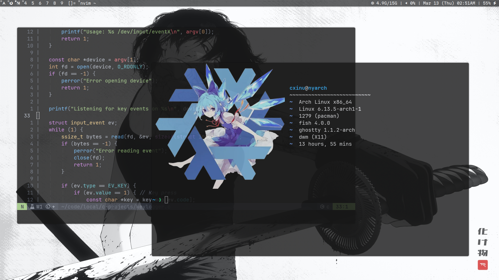

# Dotfiles

This repository contains my personal Linux dotfiles, managed with GNU Stow for symlink-based configuration. Use it as a base layer for customizing your configuration.



## Installation

### Clone the Repository

```bash
git clone https://github.com/cxinu/dotfiles.git ~/dotfiles
cd ~/dotfiles
```

### Install GNU Stow

Ensure `stow` is installed:

```bash
sudo pacman -S stow
```

### Deploy Configurations

To apply all configurations:

```bash
stow -n -v . # dry run
stow .
```

### Handling Existing Configurations

If conflicts arise due to existing configurations, remove them before stowing:

```bash
rm -rf ~/.config/fish ~/.config/nvim ~/.config/kitty
stow .
```

## Updating Configurations

To pull the latest changes and reapply symlinks:

```bash
git pull
stow .
```
